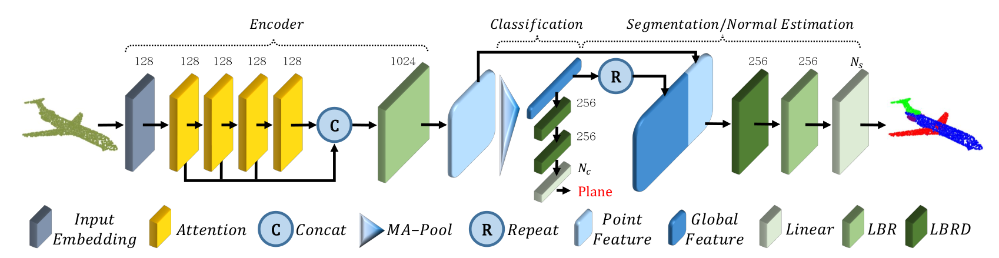

# Point Cloud Transformer



## Description

Implementation of PCT(Point Cloud Transformer) in PyTorch.

> **Abstract**: The irregular domain and lack of ordering make it challenging to design deep neural networks for point cloud processing. This paper presents a novel framework named
> Point Cloud Transformer(PCT) for point cloud learning. PCT is based on Transformer, which achieves huge success in natural language processing and displays great potential in image processing. It is inherently permutation invariant for processing a sequence of points, making it well-suited for point cloud learning. To better capture local context within the point cloud, we enhance input embedding with the support of farthest point sampling and nearest neighbor search. Extensive experiments demonstrate that the PCT achieves the state-of-the-art performance on shape classification, part segmentation and normal estimation tasks.

## Environment

* Ubuntu 18.04 LTS
* CUDA 11.0
* PyTorch 1.7.0

## Training

Before you excute the training code, you need to install the module in `pointnet2_ops_lib`:

```shell
pip install pointnet2_ops_lib/.
```

In order to training the model, you can use the following command:

```shell
python cls.py --model=pct --exp_name=pct_cls --num_points=1024 --use_sgd=True --batch_size=32 --epochs 250 --lr 0.0001
```

Just modify the parameters if you want to change to another model, etc.

## Testing

In order to testing the model, you can use the following command:

```shell
python main.py --exp_name=test --num_points=1024 --use_sgd=True --eval=True --model_path=checkpoints/pct_cls/models/model.t7 --test_batch_size=32
```

Just modify the parameters if you want to change to another model, etc.

## Citation

1. https://arxiv.org/pdf/2012.09688.pdf
2. https://github.com/MenghaoGuo/PCT
3. https://github.com/uyzhang/PCT_Pytorch
